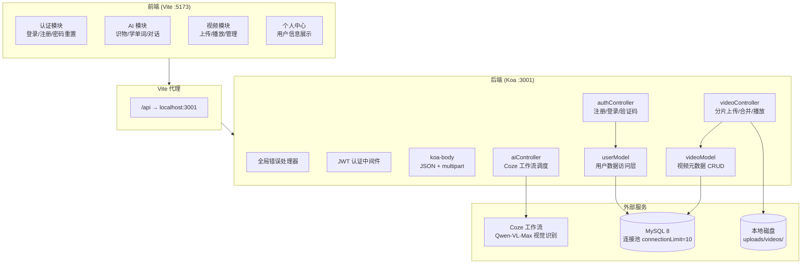
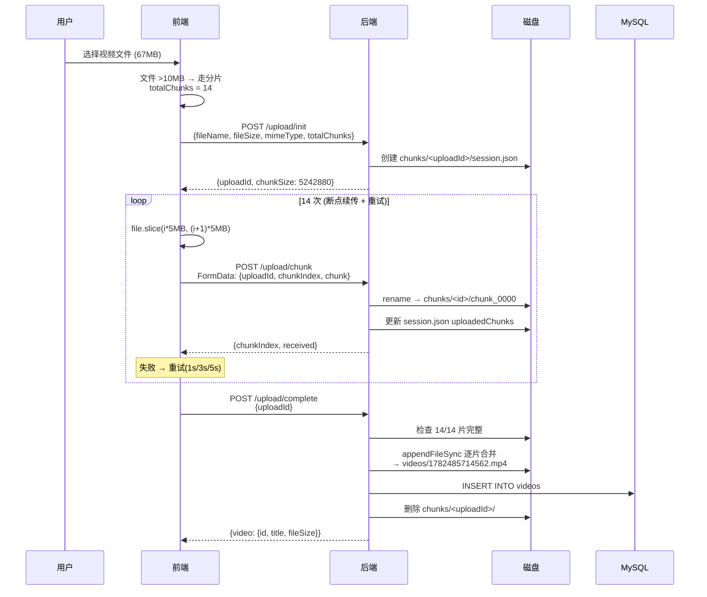
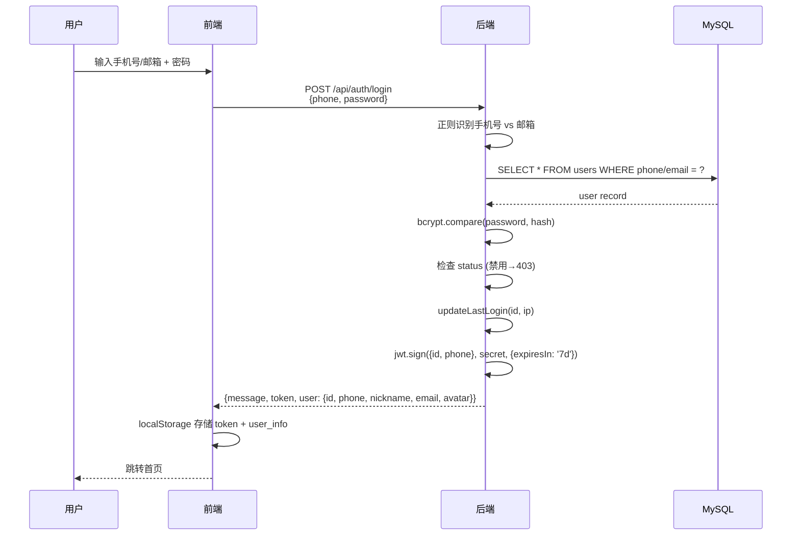

# AI KidEdu — 亲子教育 AI 全栈应用

AI KidEdu 是一款面向 0-12 岁儿童与家长的 AI 亲子教育应用，结合计算机视觉和自然语言处理技术，提供**拍照识物**、**拍照学单词**、**AI 智能对话**、**视频中心**等核心功能，帮助孩子在日常生活中探索学习。

---

## 功能特性

| 模块 | 功能 | 技术实现 |
|------|------|----------|
| 用户系统 | 手机号/邮箱注册登录、密码重置、QQ OAuth | JWT (7天) + bcrypt (10轮) + SVG 图形验证码 |
| AI 拍照识物 | 拍摄物品，AI 识别并返回名称/类别/描述/安全提示/拼音 | 浏览器摄像头 + Canvas 压缩 + Coze 工作流 (Qwen-VL-Max) |
| AI 拍照学单词 | 拍摄物品，AI 返回英语单词/音标/释义/例句 | 同上 |
| AI 智能对话 | 文字/语音交互，AI 陪伴聊天 | React + MediaRecorder 录音 |
| 语音播报 | 识别结果和单词的语音朗读 | Web Speech API (TTS) |
| 视频中心 | 上传/播放/删除视频，分片上传 + 断点续传 | koa-body multipart + 分片合并 + Range 流式播放 |

---

## 技术架构



---

## 数据流

### AI 拍照识物 / 学单词

```mermaid
sequenceDiagram
    participant User as 用户
    participant FE as 前端 (React)
    participant BE as 后端 (Koa)
    participant Coze as Coze 工作流
    participant Qwen as Qwen-VL-Max

    User->>FE: 拍照 / 选择图片
    FE->>FE: Canvas 压缩<br/>max 800px, JPEG 0.7
    FE->>FE: 转 base64 Data URL

    User->>FE: 点击识别
    FE->>BE: POST /api/ai/recognize<br/>{image: "data:image/jpeg;base64,...", type: "object"|"word"}
    BE->>Coze: POST 工作流部署地址<br/>{image: {url: "<base64>", file_type: "image"}}
    Coze->>Qwen: 多模态消息 (图片 + prompt)
    Qwen-->>Coze: 结构化 JSON
    Coze-->>BE: {code: 0, data: "{...}"}
    BE->>BE: JSON 清洗 + 解析
    BE-->>FE: {success: true, data: {...}}
    FE->>FE: 渲染 ResultComponent
    FE->>FE: Web Speech API 语音播报
    FE-->>User: 展示结果
```

### 大文件分片上传



### 用户登录



---

## 数据库设计

### users 表

```sql
CREATE TABLE users (
  id              INT UNSIGNED AUTO_INCREMENT PRIMARY KEY,
  nickname        VARCHAR(50)    NOT NULL,
  phone           VARCHAR(20)    NOT NULL UNIQUE,
  email           VARCHAR(100)   DEFAULT NULL,
  password_hash   VARCHAR(255)   NOT NULL,
  avatar          VARCHAR(255)   DEFAULT NULL,
  status          TINYINT UNSIGNED NOT NULL DEFAULT 1,  -- 1=正常 0=禁用
  last_login_at   DATETIME       DEFAULT NULL,
  last_login_ip   VARCHAR(45)    DEFAULT NULL,
  created_at      DATETIME       NOT NULL DEFAULT CURRENT_TIMESTAMP,
  updated_at      DATETIME       NOT NULL DEFAULT CURRENT_TIMESTAMP ON UPDATE CURRENT_TIMESTAMP,
  INDEX idx_email (email),
  INDEX idx_status (status)
);
```

### videos 表

```sql
CREATE TABLE videos (
  id            INT UNSIGNED AUTO_INCREMENT PRIMARY KEY,
  user_id       INT UNSIGNED NOT NULL,
  title         VARCHAR(100) NOT NULL,
  original_name VARCHAR(255) NOT NULL,
  filename      VARCHAR(255) NOT NULL,
  file_size     BIGINT UNSIGNED NOT NULL,
  mime_type     VARCHAR(50) NOT NULL,
  duration      FLOAT DEFAULT NULL,
  created_at    DATETIME NOT NULL DEFAULT CURRENT_TIMESTAMP,
  INDEX idx_user_id (user_id),
  INDEX idx_created_at (created_at)
);
```

---

## API 文档

### 认证接口 (`/api/auth`)

| 方法 | 路径 | 说明 | 认证 |
|------|------|------|:--:|
| `POST` | `/register` | 用户注册（含昵称校验 2-20字） | — |
| `POST` | `/login` | 手机号/邮箱登录，自动识别 | — |
| `GET` | `/captcha` | 获取 SVG 图形验证码 | — |
| `GET` | `/me` | 获取当前登录用户信息 | Bearer Token |
| `POST` | `/forgot-password/reset` | 重置密码 | — |
| `GET` | `/qq` | QQ OAuth 登录跳转 | — |
| `GET` | `/qq/callback` | QQ 回调 | — |

### AI 接口 (`/api/ai`)

| 方法 | 路径 | 说明 |
|------|------|------|
| `POST` | `/recognize` | 图片识别，body: `{image: "<base64 data URL>", type: "object"|"word"}` |

### 视频接口 (`/api/videos`)

| 方法 | 路径 | 说明 |
|------|------|------|
| `POST` | `/upload` | 小文件直传（≤10MB），multipart |
| `POST` | `/upload/init` | 分片上传初始化 |
| `POST` | `/upload/chunk` | 上传单个分片，multipart |
| `GET` | `/upload/status/:uploadId` | 查询上传进度（断点续传） |
| `POST` | `/upload/complete` | 合并分片，写入 DB |
| `DELETE` | `/upload/:uploadId` | 中止/清理上传 |
| `GET` | `/` | 视频列表（分页） |
| `GET` | `/:id` | 视频详情 |
| `GET` | `/:id/file` | 流式播放（支持 Range 拖动进度条） |
| `DELETE` | `/:id` | 删除视频（仅本人） |

---

## 项目结构

```text
AI_KidEdu/
├── package.json                          # 根配置，统一 build & start 脚本
├── README.md
│
├── backend/
│   ├── package.json                      # 后端依赖
│   ├── .env                              # 环境变量（不提交 Git）
│   ├── nodemon.json                      # nodemon 配置（忽略 uploads/）
│   ├── scripts/
│   │   └── initDb.js                     # 建库 + 建表 + 自动迁移缺失列
│   ├── uploads/                          # 上传文件存储（不提交 Git）
│   │   ├── videos/                       # 完成的视频文件
│   │   └── chunks/                       # 上传中的临时分片
│   └── src/
│       ├── index.js                      # Koa 入口，全局错误处理 + 中间件注册
│       ├── config/
│       │   └── db.js                     # MySQL 连接池（兼容 Railway MYSQL_URL）
│       ├── controllers/
│       │   ├── authController.js         # 注册/登录/me/QQ OAuth/验证码/重置密码
│       │   ├── aiController.js           # AI 识别调度（→ Coze 工作流）
│       │   └── videoController.js        # 上传/分片/合并/播放/删除
│       ├── middleware/
│       │   └── auth.js                   # JWT 解析中间件 → ctx.state.user
│       ├── models/
│       │   ├── userModel.js              # 用户 CRUD（findByPhone/Email/create/update）
│       │   └── videoModel.js             # 视频元数据 CRUD
│       ├── routes/
│       │   ├── authRoutes.js             # /api/auth/*
│       │   ├── aiRoutes.js               # /api/ai/*
│       │   └── videoRoutes.js            # /api/videos/*
│       └── utils/
│           ├── captcha.js                # SVG 验证码生成与校验
│           └── cozeClient.js             # Coze 工作流调用客户端
│
└── frontend/
    ├── package.json                      # 前端依赖
    ├── vite.config.js                    # Vite 配置（含大文件代理超时 10min）
    ├── index.html                        # SPA 入口
    └── src/
        ├── main.jsx                      # ReactDOM.createRoot 挂载
        ├── App.jsx                       # 路由配置 + ProtectedRoute 认证守卫
        ├── components/
        │   ├── ImageCaptureAndProcess.jsx  # 通用拍照识别（组合模式）
        │   ├── ImageCaptureAndProcess.less
        │   ├── ObjectRecognitionResult.jsx # 识物结果卡片
        │   ├── WordLearningResult.jsx      # 单词学习结果卡片
        │   ├── BottomNavigation.jsx        # 底部 Tab 导航
        │   ├── Toast.jsx                   # 轻提示组件
        │   └── Toast.less
        ├── pages/
        │   ├── Home.jsx                  # 首页（功能入口网格）
        │   ├── Login.jsx                 # 登录（SVG 眼睛图标密码切换）
        │   ├── Register.jsx              # 注册
        │   ├── ForgotPassword.jsx        # 忘记密码
        │   ├── AIPage.jsx                # AI 功能聚合页
        │   ├── ObjectRecognitionPage.jsx # 拍照识物
        │   ├── LearnWordsPage.jsx        # 拍照学单词
        │   ├── AIDialoguePage.jsx        # AI 智能对话
        │   ├── MinePage.jsx              # 个人中心（显示昵称/手机号）
        │   ├── VideoListPage.jsx         # 视频列表 + 分片上传 + 进度
        │   └── VideoPlayerPage.jsx       # 沉浸式播放 + 删除确认弹窗
        └── styles/
            ├── variables.less            # 设计 Token：16色/6圆角/3阴影/9字号/9间距
            ├── app.less
            ├── login.less
            ├── register.less
            ├── aiPage.less
            ├── home.less
            ├── minePage.less
            ├── objectRecognition.less
            ├── learnWords.less
            ├── aiDialogue.less
            ├── videoList.less
            └── videoPlayer.less
```

---

## 核心设计

### 中间件栈（按顺序执行）

```
app
  .use(全局错误处理器)        // try/catch 兜底所有异常，返回 JSON
  .use(authMiddleware)       // 解析 JWT → ctx.state.user（不阻塞未登录请求）
  .use(koaBody)              // JSON + multipart/form-data 解析（最大 500MB）
  .use(router)               // /api 主路由 + /api/health
  .use(authRoutes)           // /api/auth/*
  .use(aiRoutes)             // /api/ai/*
  .use(videoRoutes)          // /api/videos/*
```

### 分片上传重试机制

```js
// 前端：每片最多重试 3 次，指数退避
for (let retry = 0; retry < 3; retry++) {
  try {
    await fetch('/api/videos/upload/chunk', { body: chunkForm });
    break;  // 成功
  } catch (err) {
    await sleep([0, 1000, 3000][retry]);  // 0s → 1s → 3s
  }
}
// 3 次全败 → 显示错误，已上传的分片保留在磁盘可续传
```

### 设计 Token 体系

```less
// styles/variables.less
@primary: #5BBA8A;           // 薄荷绿主色
@primary-dark: #4A9E72;      // 深绿（hover/active）
@secondary: #F5C842;         // 暖黄辅色
@text-primary: #2C3E50;      // 深蓝灰正文
@text-secondary: #7F8C8D;    // 辅助文字
@bg-page: #F8F9FA;           // 页面背景
@bg-card: #FFFFFF;            // 卡片背景
@error: #E74C3C;             // 错误红

@font-family: -apple-system, BlinkMacSystemFont, 'PingFang SC', 'Microsoft YaHei', sans-serif;
@radius-sm: 8px;  @radius-md: 12px;  @radius-lg: 16px;
@shadow-light: 0 2px 8px rgba(0,0,0,.04);
@transition-normal: 0.25s ease;
```

---

## 快速启动

### 本地开发

```bash
# 1. 安装依赖
cd backend && npm install
cd ../frontend && npm install

# 2. 配置后端环境变量
cd backend
cp .env.example .env   # 编辑 .env，填入 DB 密码、Coze Token 等

# 3. 初始化数据库
npm run init-db

# 4. 启动后端（:3001）
npm run dev

# 5. 新终端，启动前端（:5173）
cd frontend
npm run dev
```

测试账号：`13800000000` / `123456`

### 环境变量

| 变量 | 说明 | 本地默认值 |
|------|------|-----------|
| `DB_HOST` / `DB_PORT` / `DB_USER` / `DB_PASSWORD` / `DB_NAME` | 数据库连接 | 本地 MySQL |
| `DATABASE_URL` / `MYSQL_URL` | Railway 连接串（优先） | — |
| `JWT_SECRET` | JWT 签名密钥 | 本地 dev 值 |
| `COZE_TOKEN_OBJECT` | 拍照识物工作流 JWT | — |
| `COZE_URL_OBJECT` | 拍照识物部署地址 | — |
| `COZE_TOKEN_WORD` | 拍照学单词工作流 JWT | — |
| `COZE_URL_WORD` | 拍照学单词部署地址 | — |

### 生产部署 (Railway)

```bash
# Railway 自动执行:
npm run build   # 安装依赖 + 构建前端
npm start       # node scripts/initDb.js && NODE_ENV=production node src/index.js
```

Railway 部署时需要：
1. 添加 MySQL 插件 → 自动注入 `MYSQL_URL`
2. 在 Variables 中添加 `JWT_SECRET`、Coze 相关变量
3. 挂载 Volume (`/app/uploads`) 持久化视频文件

---

## 关键依赖

| 包名 | 用途 |
|------|------|
| `koa` / `koa-router` | 后端 HTTP 框架 |
| `koa-body` | JSON + multipart 请求体解析 |
| `koa-static` | 生产环境托管前端静态文件 |
| `mysql2` | MySQL 连接池 + 参数化查询 |
| `bcryptjs` | 密码哈希 (cost=10) |
| `jsonwebtoken` | JWT 签发与校验 (7天过期) |
| `svg-captcha` | SVG 图形验证码 |
| `axios` | HTTP 请求（Coze API 调用） |
| `react` / `react-dom` | 前端 UI 框架 |
| `react-router-dom` | SPA 客户端路由 |
| `vite` | 前端构建工具 + dev proxy |
| `less` | CSS 预处理（设计 Token 体系） |

---

## 安全措施

| 层面 | 措施 |
|------|------|
| SQL 注入 | 全部使用 `?` 参数化查询 |
| 密码 | bcrypt 10 轮哈希，永不存明文 |
| 认证 | JWT 7 天过期 + 客户端 24h 本地过期 |
| 文件 | 魔数值白名单校验 (mp4/webm/avi/mov/mkv) |
| 上传 | 最大 500MB，分片指数退避重试 |
| 删除 | 只能删除自己上传的视频 |
| 错误 | 全局 try/catch 返回 JSON，不泄露堆栈 |
| 频率 | 预留中间件接口（注册/IP 限制） |
