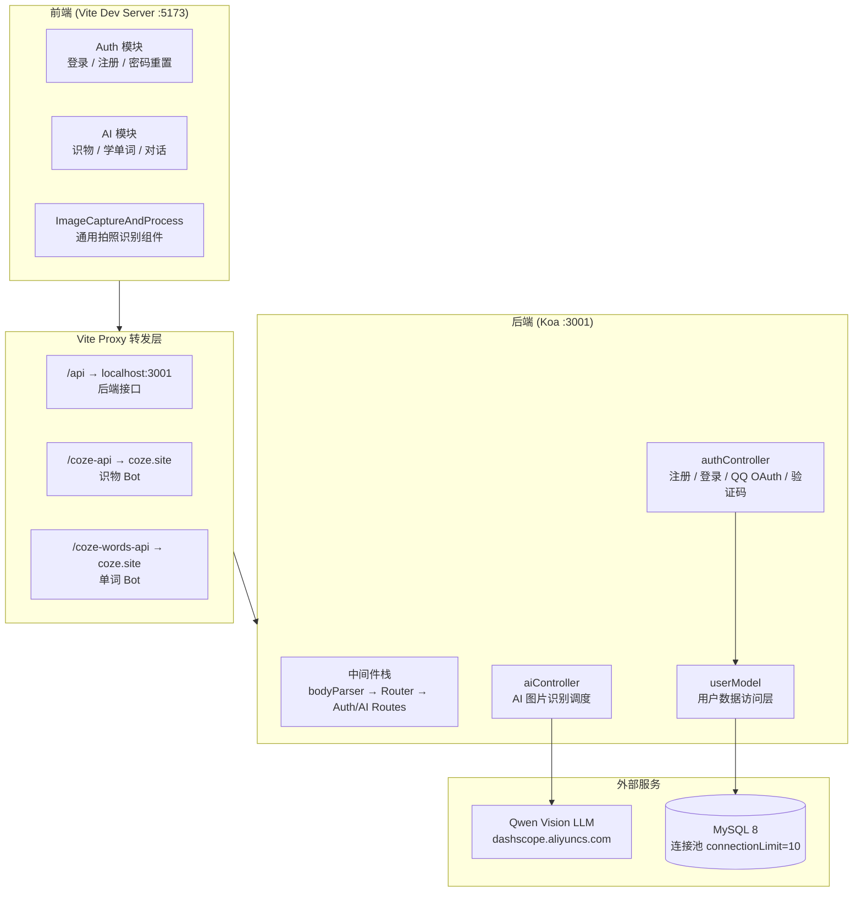
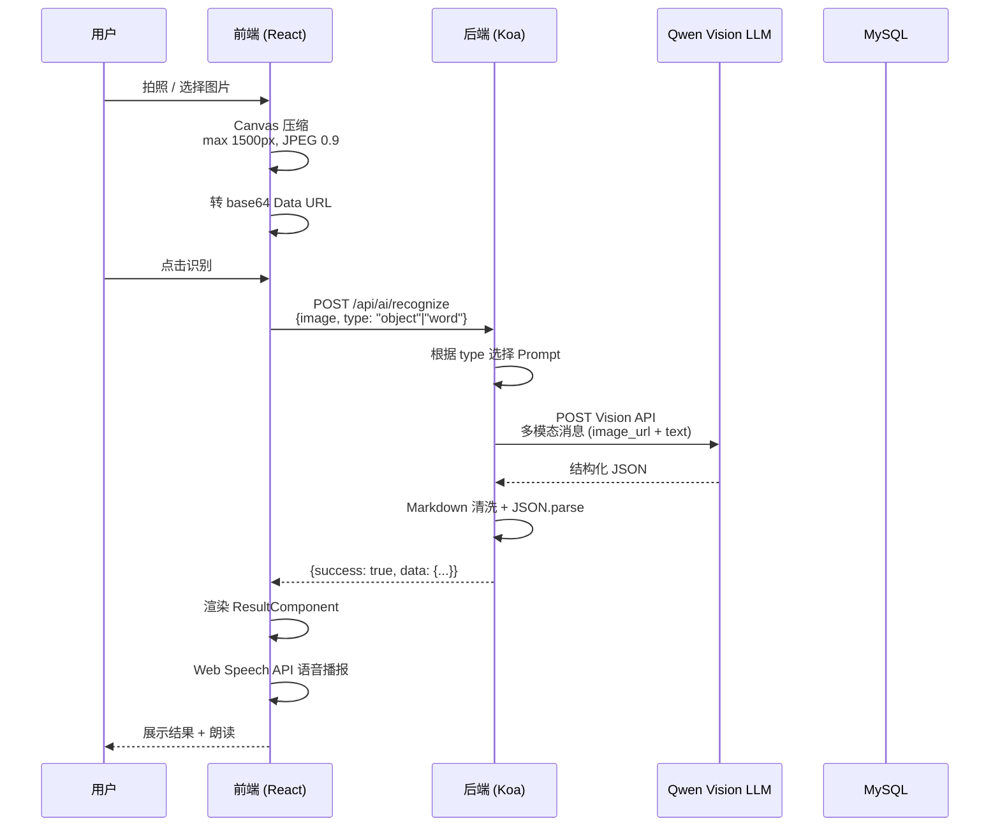
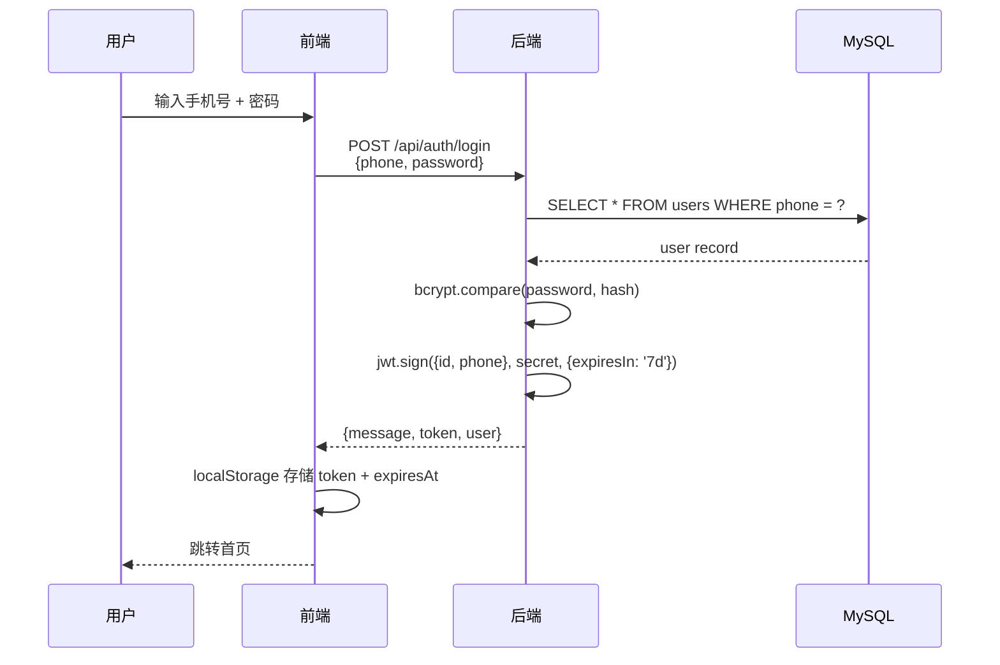

# AI KidEdu — 亲子教育 AI 全栈应用

## 项目简介

AI KidEdu 是一款面向 0-12 岁儿童与家长的 AI 亲子教育应用，结合计算机视觉和自然语言处理技术，提供**拍照识物**、**拍照学单词**、**AI 智能对话**等核心功能，帮助孩子在日常生活中探索学习。

| 模块 | 功能 | 技术实现 |
| ---- | ---- | -------- |
| 用户系统 | 手机号注册/登录、密码重置、QQ OAuth | JWT + bcrypt + 图形验证码 |
| AI 拍照识物 | 拍摄物品，AI 识别并返回名称、类别、说明、安全提示 | 浏览器摄像头 + Canvas + Qwen Vision API |
| AI 拍照学单词 | 拍摄物品，AI 返回英语单词、音标、释义、例句 | 同上，针对英语教学场景优化的 Prompt |
| AI 智能对话 | 文字/语音交互，AI 陪伴聊天 | 预留 STT/Chat API 接口 |
| 语音播报 | 识别结果和单词的语音朗读 | Web Speech API (TTS) |

## 技术栈

| 层级 | 技术 | 说明 |
| ---- | ---- | ---- |
| **前端框架** | React 18 + React Router v7 | SPA 单页应用 |
| **构建工具** | Vite 5 | HMR 热更新，代理转发 |
| **样式方案** | Less + 设计 Token 体系 | 16 色/6 圆角/3 阴影/9 字号/9 间距变量 |
| **后端框架** | Koa 2.x | 洋葱模型中间件架构 |
| **数据库** | MySQL 8 + mysql2 | 连接池模式（最多 10 连接） |
| **身份认证** | JWT (jsonwebtoken) + bcryptjs (10 轮) | 7 天有效期，手机号+密码登录 |
| **验证码** | svg-captcha | SVG 图形验证码，内存存储，5 分钟过期 |
| **AI 集成** | Qwen Vision LLM (dashscope) | 多模态消息实现图片→文本识别 |
| **语音能力** | Web Speech API + MediaRecorder | 浏览器内置 TTS 播报 + 麦克风录音 |

## 技术架构



## 数据流

### AI 拍照识物 / 学单词



### 用户登录认证



## API 文档

### 认证接口 (`/api/auth`)

| 方法 | 路径 | 说明 | 请求体 | 响应 |
| ---- | ---- | ---- | ------ | ---- |
| `POST` | `/register` | 用户注册 | `{phone, password, captchaId, captchaCode}` | `{message, user}` |
| `POST` | `/login` | 手机号登录 | `{phone, password}` | `{message, token, user}` |
| `GET` | `/captcha` | 获取图形验证码 | — | `{captchaId, captchaSvg}` |
| `POST` | `/forgot-password/reset` | 重置密码 | `{phone, captchaId, captchaCode, newPassword}` | `{message}` |
| `GET` | `/wechat` | 微信登录（占位） | — | 重定向 |
| `GET` | `/qq` | QQ 登录 | — | 重定向至 QQ 授权页 |
| `GET` | `/qq/callback` | QQ 回调 | `?code=&state=` | `{message, token, qq}` |

### AI 接口 (`/api/ai`)

| 方法 | 路径 | 说明 | 请求体 | 响应 |
| ---- | ---- | ---- | ------ | ---- |
| `POST` | `/recognize` | AI 图片识别 | `{image: "<base64>", type}` | `{success, data}` |

**type 参数：**

| 值 | 场景 | 返回字段 |
| ---- | ---- | -------- |
| `object` | 拍照识物 | `name, category, description, safetyTips, pronunciation` |
| `word` | 拍照学单词 | `word, pronunciation, definition, example1, example2` |

### 健康检查

| 方法 | 路径 | 响应 |
| ---- | ---- | ---- |
| `GET` | `/api/health` | `{status: "ok", message}` |

## 项目结构

```text
AI_KidEdu/
├── package.json                       # 根配置，统一 build & start 脚本
│
├── backend/
│   ├── package.json                   # 后端依赖声明
│   ├── .env                           # 环境变量（JWT_SECRET, QWEN_API_KEY 等）
│   ├── scripts/
│   │   └── initDb.js                  # 数据库初始化
│   └── src/
│       ├── index.js                   # Koa 入口，中间件注册，生产环境托管前端
│       ├── config/
│       │   └── db.js                  # MySQL 连接池（mysql2/promise）
│       ├── controllers/
│       │   ├── authController.js      # 注册/登录/QQ OAuth/验证码/重置密码
│       │   └── aiController.js        # AI 识别调度（Qwen Vision）
│       ├── models/
│       │   └── userModel.js           # 用户数据访问层（参数化查询）
│       ├── routes/
│       │   ├── authRoutes.js          # /api/auth/* 路由定义
│       │   └── aiRoutes.js            # /api/ai/* 路由定义
│       └── utils/
│           └── captcha.js             # SVG 验证码生成与校验
│
└── frontend/
    ├── package.json                   # 前端依赖声明
    ├── vite.config.js                 # Vite 配置（含 proxy 规则）
    ├── index.html                     # SPA 入口
    └── src/
        ├── main.jsx                   # ReactDOM.createRoot 挂载
        ├── App.jsx                    # 路由配置 + ProtectedRoute 认证守卫
        ├── components/
        │   ├── ImageCaptureAndProcess.jsx  # 通用拍照识别组件（组合模式）
        │   ├── ObjectRecognitionResult.jsx # 识物结果卡片
        │   ├── WordLearningResult.jsx      # 单词学习结果卡片
        │   ├── BottomNavigation.jsx        # 底部 Tab 导航栏
        │   └── Toast.jsx                   # 轻提示组件
        ├── pages/
        │   ├── Home.jsx                # 首页（功能入口网格）
        │   ├── Login.jsx               # 登录表单
        │   ├── Register.jsx            # 注册表单
        │   ├── ForgotPassword.jsx      # 忘记密码
        │   ├── AIPage.jsx              # AI 功能聚合页
        │   ├── ObjectRecognitionPage.jsx   # 拍照识物
        │   ├── LearnWordsPage.jsx      # 拍照学单词
        │   ├── AIDialoguePage.jsx      # AI 智能对话
        │   └── MinePage.jsx            # 个人中心
        └── styles/
            ├── app.less               # 全局样式
            └── variables.less         # 设计 Token（色板/圆角/阴影/字号/间距）
```

## 核心设计

### 后端 — Koa 洋葱模型中间件

```js
// src/index.js — 中间件按顺序执行，每个中间件包裹后续中间件
app
  .use(bodyParser())            // 1. 解析 JSON body
  .use(router.routes())         // 2. /api 主路由（含 /api/health）
  .use(router.allowedMethods()) // 3. 405 自动响应
  .use(authRoutes.routes())     // 4. /api/auth/* 认证路由
  .use(authRoutes.allowedMethods())
  .use(aiRoutes.routes())       // 5. /api/ai/* AI 路由
  .use(aiRoutes.allowedMethods());
```

### 数据库 — 连接池 + 参数化防注入

```js
// src/config/db.js — 单例连接池
const pool = mysql.createPool({
  host, port, user, password, database,
  waitForConnections: true,
  connectionLimit: 10,     // 最大并发连接
  queueLimit: 0            // 无限排队
});

// src/models/userModel.js — ? 占位符防止 SQL 注入
const [rows] = await db.execute(
  'SELECT * FROM users WHERE phone = ? LIMIT 1',
  [phone]
);
```

### 前端 — 认证守卫 + 组件组合

```jsx
// App.jsx — ProtectedRoute：纯客户端校验，不额外请求后端
const ProtectedRoute = ({ children }) => {
  const token = localStorage.getItem('auth_token');
  const expiresAt = Number(localStorage.getItem('auth_expires_at'));
  if (token && expiresAt > Date.now()) return children;
  navigate('/login');
};

// ImageCaptureAndProcess — 通过 props 注入实现场景复用
// 识物场景: onRecognition=recognizeObject, resultComponent=ObjectRecognitionResult
// 单词场景: onRecognition=recognizeWord,   resultComponent=WordLearningResult
<ImageCaptureAndProcess
  onRecognition={handleRecognition}
  resultComponent={ResultCard}
  theme="default" | "green"
/>
```

### AI 识别 — 多 Prompt 路由 + 三层防御

```js
// aiController.js — 按 type 路由到不同 Prompt
const PROMPTS = {
  object: '识别图片中的物品，严格只返回纯JSON：' +
    '{"name":"物品名","category":"类别","description":"儿童友好描述","safetyTips":"安全提示","pronunciation":"汉语拼音"}',
  word: '识别图片中最主要的物品，返回对应英语单词，严格只返回纯JSON：' +
    '{"word":"英语单词","pronunciation":"音标","definition":"中文释义","example1":"例句1","example2":"例句2"}',
};

// 三层防御：
// 1. 可选链兜底：choices?.[0]?.message?.content || ''
// 2. Markdown 清洗：.replace(/```json\s*/g, '').replace(/```\s*/g, '')
// 3. try/catch 兜底：解析失败返回 500
```

### 设计 Token 体系

```less
// styles/variables.less
@primary: #5BBA8A;          // 薄荷绿主色
@secondary: #F5C842;        // 暖黄辅色
@text-primary: #2C3E50;     // 深蓝灰正文
@font-family: -apple-system, 'PingFang SC', 'Microsoft YaHei', sans-serif;

// 圆角: @radius-sm(8px) → @radius-full(50%)
// 阴影: @shadow-light / @shadow-medium / @shadow-heavy
// 字号: @font-size-xs(12px) → @font-size-3xl(28px)
// 间距: @space-xs(4px) → @space-4xl(32px)
```

## 快速启动

```bash
# 1. 配置环境变量
cd backend
# 编辑 .env 文件，配置 DB_PASSWORD、JWT_SECRET、QWEN_API_KEY 等

# 2. 初始化数据库
npm run init-db

# 3. 启动后端（开发模式，端口 3001）
npm run dev

# 4. 启动前端（开发模式，端口 5173）
cd ../frontend
npm run dev
```

测试账号：`13800000000` / `123456`

## 生产部署

```bash
# 构建前端 + 安装依赖
npm run build

# 启动生产服务（Koa 托管前端 dist，单一端口）
npm start
```

生产模式下，Koa 通过 `koa-static` 托管 `frontend/dist`，并设置 SPA fallback（非 `/api` 请求返回 `index.html`），前后端同源，无需额外 CORS 配置。数据库连接通过 `DATABASE_URL` 环境变量注入，兼容 Railway 等 PaaS 平台。

## 贡献指南

1. Fork 本仓库并创建功能分支：`git checkout -b feature/amazing-feature`
2. 保持代码风格一致：后端 CommonJS，前端 ES Module + JSX
3. 提交信息使用清晰格式：`feat: xxx` / `fix: xxx` / `docs: xxx`
4. 确保改动不破坏现有功能，新功能附带测试
5. 提交 PR 时说明改动背景、实现方案和测试结果
